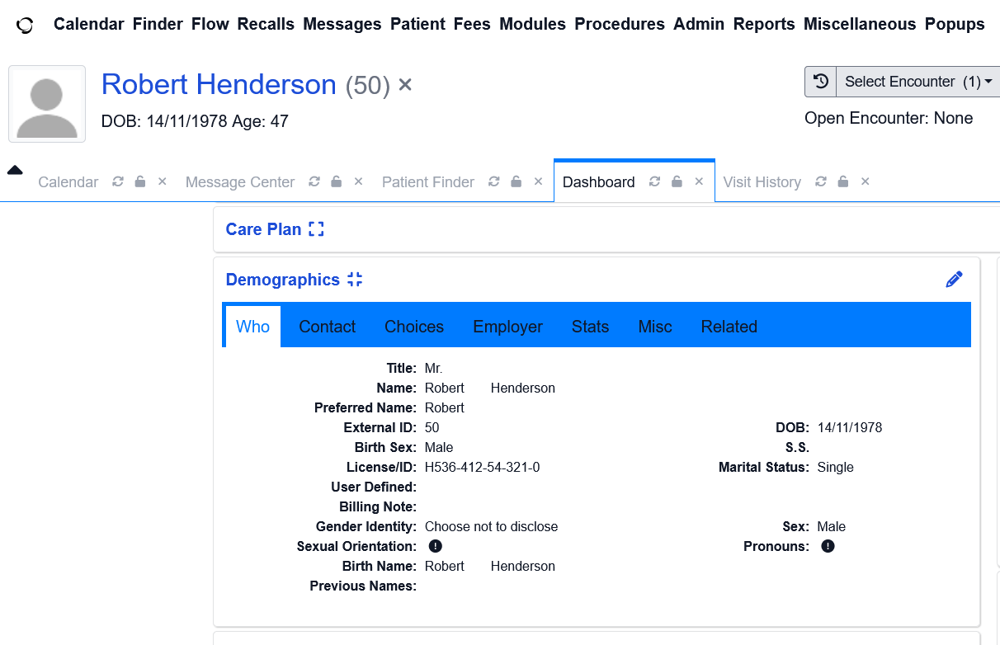
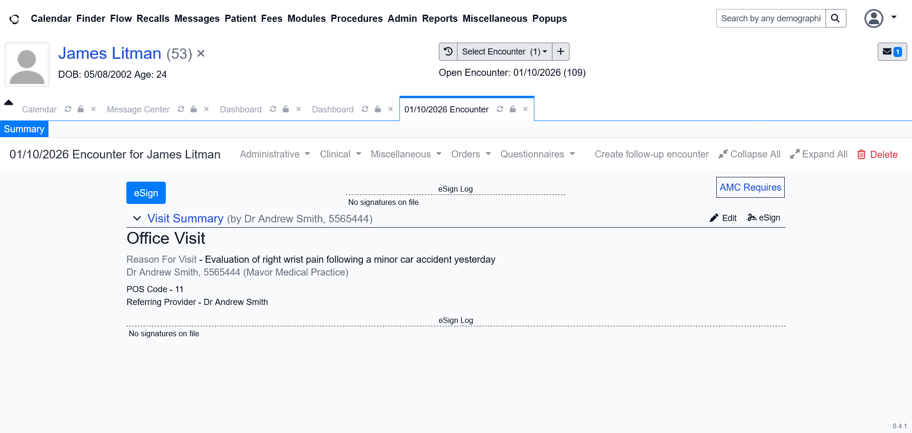

# Case Study: EHR Database Engineering & Patient Workflow Simulation
**Platform Used:** OpenEMR (ONC-Certified Ambulatory System)  
**Methodology:** Johns Hopkins Medical Office Framework & HIPAA Administrative Safeguards  

### 1. Project Objective
This project documents the development of a sandbox clinical database inside an open-source Electronic Health Record (EHR) environment (**OpenEMR**). The simulation validates hands-on competency in high-volume patient demographic data entry, insurance verification routing, clinical encounter mapping, and regulatory compliance standards. It bridges **Management Information Systems (MIS)** structural concepts with live healthcare operations.

### 2. Data Protocol & Administrative Validation Standards
To mirror rigorous professional healthcare administration and compliance standards, the following protocols were established during execution:

* **Demographics & Patient Matching:** Prioritized complete entry of core identity vectors (Legal Names, Dates of Birth, Gender, Active Status) to emphasize medical record accuracy and actively mitigate the risk of dangerous patient-matching errors.
* **Payer Substitution & Optimization:** Actively managed software inventory limitations by dynamically mapping invalid commercial options to valid regional payers inside OpenEMR, demonstrating systems adaptability when handling legacy databases.
* **Revenue Cycle Routing & Complex Claims:** Structured independent coordination workflows for complex auto/PIP accidents by logging custom clear-text directives in the system Billing Notes. This ensures proper cross-functional data tracking before bill generation, expediting **Revenue Cycle Management (RCM)**.
* **Information Security & HIPAA Compliance:** Exercised HIPAA-aligned principles leveraging my **CompTIA Security+** framework, including validation rules for data integrity, alphanumeric formatting accuracy for Medicare Beneficiary Identifiers (MBIs), and proper session-clearing protocols.

***

### 3. Fictional Patient Registry & Live System Execution
The following database matrix was built out in the OpenEMR sandbox environment to simulate diverse clinical pathways and billing workflows:

| Patient Name | Primary Payer | Visit Reason (Chief Complaint) | ICD-10 Code Assigned |
| :--- | :--- | :--- | :--- |
| **Robert Henderson** | UnitedHealthcare | Hypertension Follow-up | `I10` (Essential Hypertension) |
| **Maria Rodriguez-Cruz** | Aetna Choice POS II | Acute Pharyngitis / Sore Throat | `J02.9` (Acute Pharyngitis, Unspecified) |
| **James Litman** | UHC / Auto Ins Flag | Right Wrist Pain (Auto Accident) | `M79.641` (Pain in Right Wrist) |

***

### 4. System Screenshots & Visual Evidence
*Note: All data entries are entirely fictional and designed strictly to simulate real-world EHR administration.*

#### Phase A: Patient Intake & Demographics Matching
  
*Caption: Figure 1: OpenEMR registration interface proving demographic validation, active tracking metrics, and structured payer mapping.*

#### Phase B: Encounter Mapping & Service Tracking
  
*Caption: Figure 2: Simulation of a complex auto-accident charting encounter. Note the integration of specialized billing notes to prevent upstream Revenue Cycle Management (RCM) friction.*

***

### 5. Transferable Tech & Operations Competencies
* **EHR System Fluency:** Direct navigation and database updates within ONC-certified ambulatory systems.
* **Workflow Automation:** Mapping health data pipelines similarly to managed ITIL/ticketing platforms (e.g., ConnectWise PSA).
* **Medical Office Governance:** Understanding the intersection of data integrity, ICD-10 clinical coding, and HIPAA Privacy compliance as taught via **Johns Hopkins University**.

